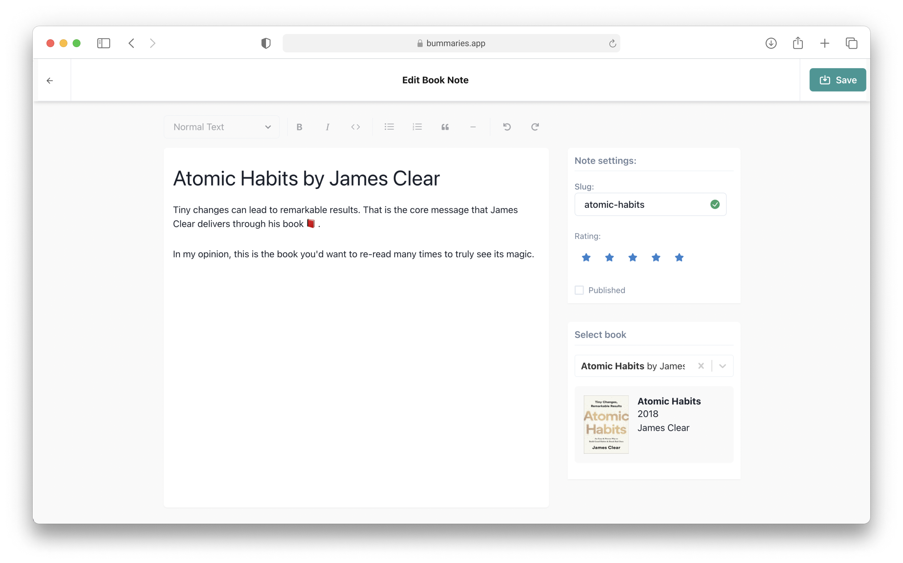

# README

A note taking app for book readers.



## Features

- Take book notes in WYSIWYG editor
- See all your book notes in public profile page
- Edit your profile to
- Save your notes in Firebase firestore

## About

Bummaries is an app to help you write and share your book notes. You can use the demo app at [bummaries.app](https://bummaries.app). All the data is stored in Firebase Firestore. Authenticaion is also powered by Firebase Auth.

Under the hood, it is powered by NextJS and Firebase. You can also host the app yourself by providing firebase settings in `.env` file.

## Getting Started

Clone and install

```bash
npx degit madebyaman/book-notes
cd book-notes
yarn
```

Copy `.env.example` file, and create your own `.env` file. You'll need to provide:

- 2 cloudinary presets. One for uploading book covers, and one for profile photos. [Learn more about cloudinary presets](https://cloudinary.com/documentation/upload_presets)
- Firebase api key, auth domain, and project Id, which you can get from Firebase.

Finally, run the development server:

```bash
npm run dev
# or
yarn dev
```

Open [http://localhost:3000](http://localhost:3000) with your browser to see the result.
